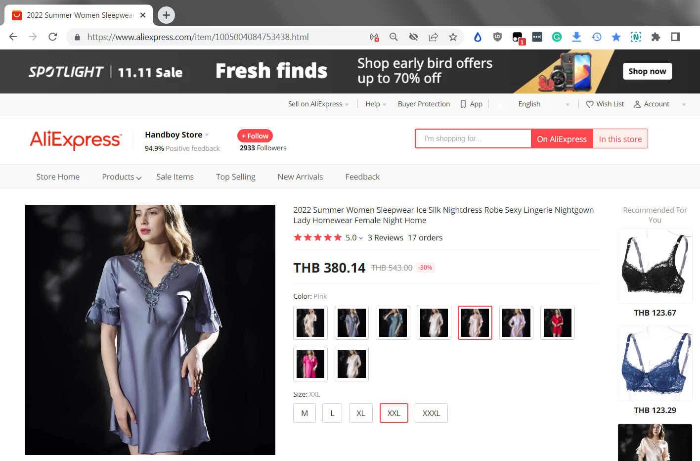

Get rid of all those useless parameters on the product item URL.  

> https://www.aliexpress.com/item/1005002664424654.html?spm=a2g0o.detail.1000060.3.2e107cc3KSiOCj&gps-id=pcDetailBottomMoreThisSeller&scm=1007.13339.291025.0&scm_id=1007.13339.291025.0&scm-url=1007.13339.291025.0&pvid=6bddc61b-084d-47f0-a227-7601e0a43141&_t=gps-id:pcDetailBottomMoreThisSeller,scm-url:1007.13339.291025.0,pvid:6bddc61b-084d-47f0-a227-7601e0a43141,tpp_buckets:668%232846%238110%231995&pdp_ext_f=%7B%22sku_id%22%3A%2212000021615052922  
> 
> to  
> 
> https://www.aliexpress.com/item/1005002664424654.html  

